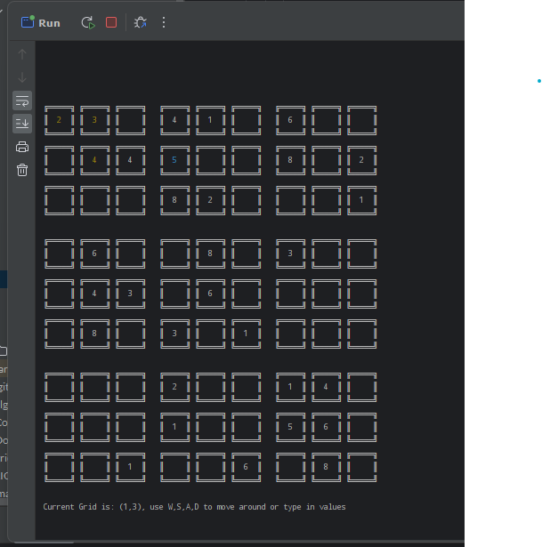
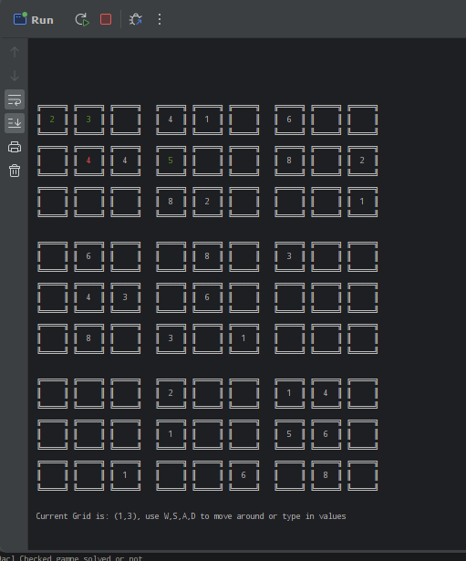

# Sudoku Game Grid🎮
- added `classes` and `workflow for packaging`
- added `dockers`
- added The `Game Engine`

## Objectives🎯
- `9 x 9` grid with `Easy` `Medium` and `Hard` Level
- `X x Y` grid 

### Author 👨‍💻 and Certifications 📜
- Zin Lin Htun
- Project Status 
- [](https://github.com/zin-lin/Sudoku/blob/main/LICENCE)


### Tool Chain 🔨
- `Java` ☕
- `Maven`
- `IntelliJ`📱
- `Dockerfile` 🐳
- Preview Gameplay
- 
- Preview Help mode
- 


### ChangeLog 💻
- `Interactive Console` is now working - `(15:28 2023/02/10)`
- `@Deprecated` - `SudokuGenerator` and `Easy Sudoku Class` - `(18:00 2023/02/09)` 
- Added `SudokuGenarator` and `Helper` classes to check grid- `(19:10 2023/02/01)`
- Added `Easy Sudoku Class` - `(17:22 2023/02/01)`
- Added `Separator` - `(16:36 2023/02/01)`
- Added Multi-dimensional reshape Support - `(16:31 2023/02/01)`
- Added `Dockerfile` - `(23:50 2023/01/31)`
- Fixed Bugs with `UTF-8` - `(21:31 2023/01/31)`
  - Do use 
    ```powershell
     Ctrl + F 5 //IntelliJ
    ```
